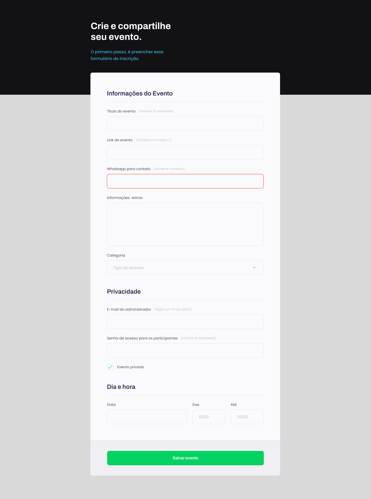

<h1 align="center"> Programe seu evento </h1>

Projeto desenvolvido nas aulas expositivas do Stage03 do Explorer.  
<a href="https://www.rocketseat.com.br/explorer">Estude esse projeto no módulo Explorer.</a>

  <a href="#-tecnologias">Tecnologias</a>&nbsp;&nbsp;&nbsp;|&nbsp;&nbsp;&nbsp;
  <a href="#-projeto">Projeto</a>&nbsp;&nbsp;&nbsp;|&nbsp;&nbsp;&nbsp;
  <a href="#-layout">Layout</a>

 

  

## 🚀 Tecnologias

Esse projeto foi desenvolvido com as seguintes tecnologias:

- HTML e CSS
- Git e Github
- Figma

## 💻 Projeto

O Explorer é o programa mais completo de formação da Rocketseat onde você desenvolve as habilidades técnicas e comportamentais pra decolar na carreira de dev.

- [Acesse o projeto finalizado, online](https://jakunzler.github.io/explorer_stage03_formulario_evento/)

## 🔖 Layout

Você pode visualizar o layout do projeto através [DESSE LINK](https://www.figma.com/file/YAnBjMzmDa7UKZDHRe8vVu/Explorer-Stage-03-Projeto-01-(Copy)?node-id=0%3A1&t=c01wEkH46QUN2MOd-0). É necessário ter conta no [Figma](https://figma.com) para acessá-lo.

---

Feito com ♥ by Dr. Jonas Augusto Kunzler :wave: [Repositório com meus projetos!](https://github.com/jakunzler). &nbsp;&nbsp;&nbsp;&nbsp;  &nbsp;|&nbsp;  &nbsp;|&nbsp; 
