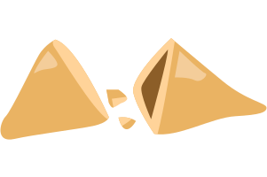

<h1 align="center"> Exercicio 01 no Stage 05 </h1>

Exercício do Stage 05 de criar uma Página Web com o jogo Biscoito da Sorte.  
<a href="https://www.rocketseat.com.br/explorer">Estude esse projeto no módulo Explorer.</a>

  <a href="#-tecnologias">Tecnologias</a>&nbsp;&nbsp;&nbsp;|&nbsp;&nbsp;&nbsp;
  <a href="#-projeto">Projeto</a>&nbsp;&nbsp;&nbsp;|&nbsp;&nbsp;&nbsp;
  <a href="#-layout">Layout</a>

 

  
  &nbsp;&nbsp;&nbsp;&nbsp;&nbsp;&nbsp;&nbsp;&nbsp;&nbsp;&nbsp;&nbsp;&nbsp;
  

## 🚀 Tecnologias

Esse projeto foi desenvolvido com as seguintes tecnologias:

- HTML e CSS
- JavaScript
- Git e Github
- Figma

## 💻 Projeto

O Explorer é o programa mais completo de formação da Rocketseat onde você desenvolve as habilidades técnicas e comportamentais pra decolar na carreira de dev.

- [Acesse o projeto finalizado, online](https://jakunzler.github.io/explorer_stage05_biscoito-sorte/)

## 🔖 Layout

Você pode visualizar o layout utilizado com modelo através [DESSE LINK](https://www.figma.com/file/ARmMpYVBJZ1mab1OvL14UX/Biscoito-da-Sorte-(Community)?node-id=1%3A2&t=ns5gXGBgSKGc8sp8-0). É necessário ter conta no [Figma](https://figma.com) para acessá-lo.

---

Feito com ♥ by Dr. Jonas Augusto Kunzler :wave: [Repositório com meus projetos!](https://github.com/jakunzler). &nbsp;&nbsp;&nbsp;&nbsp;  &nbsp;|&nbsp;  &nbsp;|&nbsp; 
